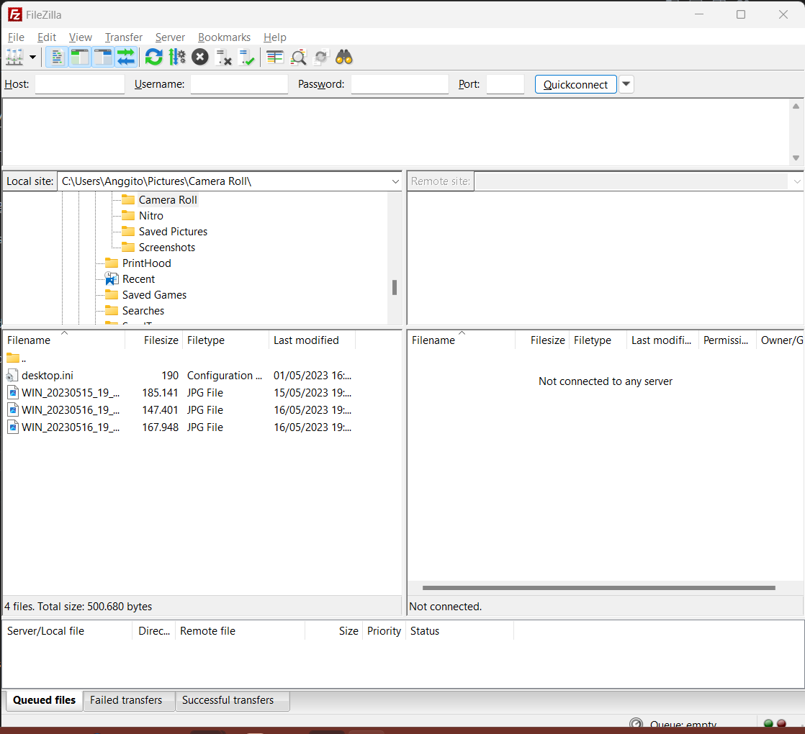

# KONFIGURASI PENGGUNAAN FTP SERVER

## 1. Download FileZilla Server
https://filezilla-project.org/download.php?platform=win64&type=server

## 2. Download FileZilla Client
https://filezilla-project.org/download.php?platform=win64

## 3. Buka Administer FileZilla Server

Setelah itu klik Connect to Server...

## 4. Konfigurasi Host, Port, dan Password

Set Host dan Port serta Password dan klik OK

## 5. Buka Server -> Configure

Pilih Tab Server, Lalu klik Configure...

## 6. User Configuration

Pada window konfigurasi, pilih Users (di dalam grup Rights management)

## 7. Buat User Baru

1. Pada tab Available User, pilih Add dan berikan nama user baru.
2. Berikan password pada user
3. Buat Virtual Path (tambahkan "/home") untuk FTP server baru beserta Native Path dari sistem lokal
4. Klik Apply
5. Tutup fileZilla Administer

## 8. Buka fileZilla Client

1. Masukkan Host, Username, dan Password sesuai yang sudah diisikan pada user di fileZilla Server
2. Isi port dengan 21 atau dikosongkan untuk koneksi FTP
3. Klik Quickconnect
4. Jika sudah bisa berjalan dengan lancar, kode [server.py](./server.py) dapat dijalankan

## NOTE !
1. Sesuaikan `USERNAME` dan `PASSWORD` pada method `connect_server()` dengan User yang ditambahkan pada fileZilla Server
2. Semua file yang dibuat, dihapus, dan diubah akan berada pada Native Path pada komputer lokal
3. Dalam konteks ini, folder [home](./home/) merupakan Native Path dari Virtual Path FTP server yang telah dibuat